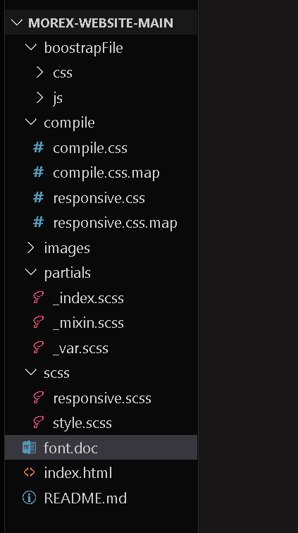

# Morex Website – using Sass with Responsive design template. 

A **responsive multipurpose website** built using **HTML5**, **CSS3**, **Boostrap** and **Sass**. This project is fully responsive and optimized for all devices, including desktop, tablet, and mobile.

---

## 🚀 Features
- Fully responsive design
- Built with Sass (SCSS)
- Modular and clean code structure
- Cross-browser compatibility
- Easy to customize with variables & mixins
- SEO-friendly and optimized performance

---

## 📂 Project Structure


---

## 🛠️ Technologies Used
- **HTML5** – Semantic markup
- **CSS3** – Modern styling & animations
- **Sass (SCSS)** – Preprocessor for better maintainability
- **JavaScript (optional)** – For interactivity (dropdowns, sliders, etc.)

---

## ⚙️ Installation & Setup

1. **Clone the repository**
   ```bash
   git clone https://github.com/yourusername/morex-with-responsive-sass.git
   cd morex-with-responsive-sass
   ```

2. **Install dependencies (if using npm)**
   ```bash
   npm install
   ```

3. **Run Sass in watch mode**
   ```bash
   npm run sass
   ```
   *(Make sure `package.json` has a script like `"sass": "sass --watch sass/main.scss css/main.css"`)*

4. **Open in browser**
   Simply open `index.html` in your browser or use Live Server:
   ```bash
   npm install -g live-server
   live-server
   ```

---

## 📱 Responsive Design
- **Mobile-first approach**
- Optimized breakpoints for:
  - **Mobile:** 320px – 480px
  - **Tablet:** 768px – 1024px
  - **Desktop:** 1200px+

---

## 🎨 Customization
Easily change **colors, fonts, and layout** by editing `partials/_var.scss`.

Example:
```scss
$primary-color: #ff5733;
$secondary-color: #222;
$font-family: 'Poppins', sans-serif;
```
---

## 📷 Screenshots
Example:


---

## 📄 License
This project is licensed under the MIT License – feel free to use and modify it.

---

## ✍️ Author
**Mehedi Hasan**  
- [GitHub](https://github.com/itzmehedihasan)  
- [Portfolio](https://yourportfolio.com)  
- [Email](mailto:itz.mehedihasan1@gmail.com)
